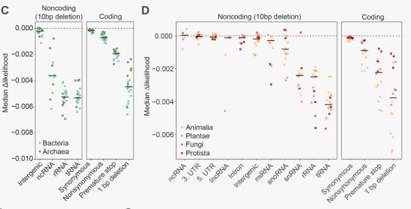

# 文献名称：Genome modeling and design across all domains of life with Evo 2

文献URL：https://www.biorxiv.org/content/10.1101/2025.02.18.638918v1

## 文章总结

### 模型概述：

Evo 2 是一个大型基因组语言模型，具有最多 400 亿个参数，能够处理最长 100 万个碱基对的序列。它适用于多个复杂层次的预测和生成任务。

Evo 2 训练了两个版本：
- 一个 7B 参数模型，训练数据为 2.4 万亿个标记。
- 一个 40B 参数模型，训练数据为 9.3 万亿个标记。
两个版本的模型都采用 两阶段训练，以捕捉从分子到有机体的生物学尺度。

### 训练数据：

Evo 2 的训练数据来自生命的所有领域（细菌、古菌、真核生物和噬菌体），并且聚焦于 非冗余的核酸序列。

训练数据总量超过 8.8 万亿个核苷酸。训练数据中排除了感染真核宿主的病毒基因组，验证了排除这些数据后，模型在真核病毒序列上的困惑度较高，表明在这一领域的语言建模表现较差。
数据集以 OpenGenome2 名称公开发布。

### 训练过程

让我们用一个简化的例子来说明Evo 2的训练过程，并通过一个大致的框架来描述每个步骤。

#### 假设：
- 目标是训练一个基于Evo 2模型的基因组语言模型，用于从DNA序列中预测下一个碱基（类似于文本生成的任务）。

#### 步骤 1：数据准备
首先，你需要一个包含大量DNA序列的数据集。为了简化，我们假设我们有以下的简短DNA序列：

```plaintext
AGCTAGCTAGCTAAGCTGAC
```

这些DNA序列是模型的输入数据。为了有效地训练，数据会被切分成更小的token（比如每3个碱基为一个token，或直接按碱基对切分）。然后，每个token会与目标label（下一个碱基）配对。

#### 步骤 2：模型架构
Evo 2使用了**StripedHyena 2**架构，这是一种卷积与注意力相结合的混合架构。它通过不同类型的操作符来处理DNA序列。对于这个例子，假设我们使用简化的变体：

- **卷积操作符**：捕捉DNA序列局部的结构和模式。
- **注意力机制**：帮助模型学习长距离依赖，例如基因组中不同位置之间的关系。

#### 步骤 3：第一阶段预训练（短上下文）
在第一阶段的预训练中，模型会在较短的上下文长度（例如，8,192个token）下进行训练。这一阶段的目标是让模型学会短距离依赖，比如基因的局部功能元素。模型的目标是预测下一个token（碱基）。

例如，给定输入序列“**AGCTAGCTAGCTA**”，模型的目标是预测下一个碱基“**A**”。在这一阶段，模型仅使用较短的序列进行训练，优化在较短范围内的预测能力。

#### 步骤 4：第二阶段中期训练（长上下文）
一旦第一阶段的预训练完成，Evo 2会进入第二阶段的中期训练，这时上下文长度扩展到**1百万个token**。在这个阶段，模型将学习更长距离的依赖关系，例如基因组的不同区域之间的相互作用。

在训练过程中，Evo 2使用了旋转嵌入等方法来扩展上下文，以便处理更长的序列。这是Evo 2的关键创新之一，允许它处理从分子到生物体尺度的长距离依赖。

#### 步骤 5：损失计算与优化
在每个训练步骤中，模型会根据输入序列生成预测（例如，预测下一个碱基），然后计算预测和实际值之间的损失。根据损失反向传播，优化模型的参数。

#### 步骤 6：模型验证与评估
训练完成后，你可以通过在未见过的DNA序列上进行评估来测试模型的效果。例如，验证模型是否能够准确地预测DNA序列中缺失的部分。

例如，如果给定序列“**AGCTAGC**”，模型应该能够预测出接下来的碱基（比如“**T**”）。

#### 简单总结：
1. **数据准备**：准备大规模DNA序列数据。
2. **模型架构**：使用**StripedHyena 2**架构，结合卷积和注意力机制。
3. **第一阶段预训练**：使用较短的上下文（如8,192 token）训练模型，学习局部依赖。
4. **第二阶段中期训练**：通过旋转嵌入等方法扩展上下文，训练更长的序列，学习长距离依赖。
5. **损失计算与优化**：计算损失，优化模型参数。
6. **评估与应用**：在新数据上评估模型的生成和预测能力。

通过这种逐步扩展上下文长度的训练方法，Evo 2能够高效地学习DNA序列中的复杂模式和长距离依赖关系，从而提高模型的预测能力和生成能力。

## 模型验证



1. **验证方法：**
   - **数据来源与基因选择：** 从NCBI获取了20种原核和16种真核物种的参考基因组序列及其注释。每个物种随机选择了1,024个蛋白质编码基因（N. equitans选择了所有536个基因）。对于每个基因，选择了从起始密码子第一碱基的前后20个碱基的基因组坐标，并将每个位置的野生型碱基突变为三种可能的替代碱基，生成单核苷酸变异（SNVs）。
   
   - **计算与对比：** 使用 Evo 2 7B 模型计算突变前后的基因序列似然差异。具体步骤如下：
     - 计算**野生型序列的似然**，即使用 Evo 2 模型预测野生型序列的似然值。
     - 计算**突变型序列的似然**，即将每个位置的野生型碱基替换为突变碱基（如A突变为C），然后预测突变后的序列似然值。
     - 计算**delta likelihood**：即突变型和野生型序列对数似然的差异，公式如下：
       \[
       \Delta \text{Likelihood} = \log(P(\text{mutant})) - \log(P(\text{wildtype}))
       \]
    
    - 正的 delta likelihood：如果 delta likelihood 是正值，说明突变后的序列比野生型序列的预测似然更高，这意味着突变可能提高了序列的适应性或功能。
    - 负的 delta likelihood：如果 delta likelihood 是负值，说明突变后的序列的似然低于野生型序列，通常意味着突变对序列产生了负面影响，例如可能破坏了基因的功能。

     - 通过计算delta likelihood，可以量化突变对基因序列适应性或功能的影响。

2. **验证结果：**
   - **零-shot预测：** Evo 2 在没有任何任务特定的微调或监督的情况下，通过零-shot预测突变效应，展示了其强大的通用性。
   - **SNV效应：** 在启动密码子附近和起始密码子位置引入突变时，Evo 2 预测的似然发生了显著变化。突变对启动密码子的影响最为明显，接着是基于三碱基的周期性模式，而在摆动位置的变化影响较小。结果显示了Evo 2成功学习了基因组中的核心结构特征。
   - **非编码区域：** 在非编码区域中，tRNA和rRNA的缺失对似然的影响大于在基因间区域的缺失，体现了这些RNA在基因组中的重要性。较大的40B模型对miRNA和snoRNA序列的缺失表现出了更高的敏感性，表明更大的模型可能捕捉到了更细致的调控特征。
   - **变异类型：** 在编码序列中，非同义变异、提前终止密码子和框移突变引起的似然变化远大于同义突变。Evo 2也能够有效地区分不同遗传密码的提前终止密码子，证明了长上下文窗口在识别这些密码子上的重要性。
   - **实验验证：** 与深度突变扫描（DMS）的实验数据进行比较，Evo 2的零-shot预测结果与实验测量的功能效应高度相关，进一步验证了其预测准确性和生物学意义。

**总结：**  
通过零-shot预测，Evo 2在没有任何微调的情况下能够成功预测不同类型的突变对基因功能的影响。其预测与实验数据高度一致，表明Evo 2具有强大的基因组变异预测能力，能够捕捉突变对蛋白质、RNA和整体适应性的影响。


## 专业术语

- likelihood of sequences 

在这里，likelihood of sequences（序列的似然）指的是模型对给定生物序列的概率估计，即模型预测该序列在训练数据中出现的可能性。对于Evo 2这样的序列模型，"似然"描述了模型对某个特定序列（例如DNA、RNA或蛋白质序列）的生成概率，或者说它认为该序列是由自然进化过程生成的可能性有多大。

具体来说，Evo 2是通过训练大规模的进化数据集来学习不同生物序列的概率分布，基于这些数据，模型可以评估一个特定突变（如单核苷酸变异，SNV）如何影响序列的整体“似然”。这意味着模型能够预测突变后的序列相较于原始序列的可能性，反映了突变对该序列功能或结构的潜在影响。

- delta likelihood（似然差异）

指的是模型计算出的突变序列（SNVs）与其对应的野生型序列在似然上的差异。具体来说，作者通过以下步骤计算delta likelihood：

突变引入：从每个物种中随机选取了1,024个蛋白质编码基因（其中N. equitans选取了所有536个基因），并在这些基因的起始密码子周围（-20nt到+20nt范围内）引入了单核苷酸变异（SNVs）。每个突变位置都用三个替代碱基之一来替代野生型碱基。

计算似然：对于每个突变位点，作者使用Evo 2模型计算野生型序列和对应的突变序列的似然。这里的似然是指Evo 2模型预测某个序列（包括其8,192nt的基因组上下文窗口）出现的概率。

计算似然差异：delta likelihood是通过比较突变序列与其野生型序列的似然差异来定义的。也就是说，delta likelihood是Evo 2模型在输入了突变序列后，预测该突变序列相对于其野生型序列的似然变化。

平均化：这些delta likelihood在每个位置上对1,024个基因进行平均，并且针对每个物种进行处理。这样可以得到每个突变位置的平均似然差异。

直观理解：
Likelihood表示一个序列在Evo 2模型中的生成概率或被模型认为符合进化模式的可能性。
Delta likelihood表示在突变引入后的序列相对于原始序列的似然变化，即突变对序列“自然性”或“功能”的影响。如果delta likelihood值很大，意味着突变对序列的影响显著，可能改变该序列的生物学功能。

- zero-shot prediction

是一种机器学习方法，它指的是模型能够在没有专门针对某一任务进行微调或监督的情况下，直接对新任务或新数据进行预测。这种方法的核心思想是通过学习到的通用知识来处理以前未见过的数据或任务，而无需专门的训练。

在传统的机器学习方法中，模型通常需要通过大量的标注数据进行训练，然后才能应用到特定的任务上。然而，zero-shot学习则希望模型能够利用在某一领域或任务上获得的知识，在没有接收到新任务的训练数据时，依然能够有效地做出预测。

在生物学中的zero-shot预测：
在文章中提到的zero-shot mutational effect prediction（zero-shot突变效应预测）是指Evo 2这样的模型能够在没有任何针对特定突变效应的监督数据或微调的情况下，通过学习进化序列数据的概率分布，直接预测突变对生物功能的潜在影响。也就是说，模型在未见过某一特定突变的情况下，依然能够基于已有的序列学习结果，推测该突变的效应。

Zero-shot学习的关键特性：
没有针对性训练数据：模型可以处理没有显式标注或监督的任务。例如，在生物序列预测中，模型没有看到具体突变的标签，但它能基于已知的序列特征进行预测。

依赖通用知识：zero-shot学习通常依赖于模型在大规模数据集上学到的通用知识或模式。例如，Evo 2在不同生物物种的序列数据上训练，从而能够学习到普遍的序列规律，应用到未知的突变预测中。

灵活性和广泛适应性：zero-shot学习使得模型在面对未知任务或数据时具有更大的适应性，能够解决许多不同类型的问题，而不需要为每个新任务单独训练。

举个例子：
假设你训练了一个生物序列模型，学到了DNA、RNA和蛋白质序列的基本结构和规律。这个模型可以用来预测某个未知突变（例如在某个基因的起始密码子处的突变）对生物体的影响，而不需要专门为这个突变进行训练。它只需要基于它之前在其他序列上的学习经验来进行预测，这就是典型的zero-shot方法。

总结来说，zero-shot prediction是一种使模型能够在没有见过特定任务的情况下，通过学习到的通用知识进行有效预测的方法。这种方法在很多领域中，特别是生物学、自然语言处理等领域，都有着非常广泛的应用潜力。


